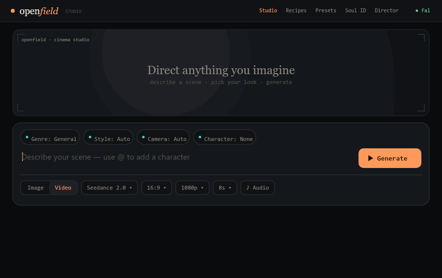

# openfield

**Open-source Higgsfield. Bring your own video-model keys — get the cinematic preset library, character consistency, an AI director, and a desktop app for free.**



**[▶ Live landing page](https://vedsoni-dev.github.io/openfield/)**

Higgsfield is really four things: (1) a router that resells Seedance / Kling / Veo / Wan behind one subscription, (2) a paywalled library of "camera control" presets that is just prompt engineering, (3) *Soul ID* character consistency, and (4) *Hermes*, an agent that orchestrates the whole pipeline. openfield gives you all four with **your own keys** and no markup.

## Why

You already pay ByteDance / fal / Replicate for the actual model. Higgsfield charges you again for the buttons on top. The buttons are prompt templates. They live in [`src/presets/`](src/presets/) — MIT, readable, extend them.

## Install

```bash
npm install && npm run build
cp .env.example .env    # add ONE key to start (FAL_KEY is highest leverage)
```

Node ≥ 20.

## Use

### CLI

```bash
openfield models                       # models + which key reaches each
openfield presets [query]              # the free preset library (47+)
openfield compose --subject "a lone samurai in the rain" --presets dolly-in,orbit
openfield generate --subject "..." --model seedance-2.0 --presets orbit --wait
openfield soul add nova --name "Nova" --ref  --traits "red bob, freckles"
openfield generate --subject "..." --character nova --presets tracking --wait
openfield auto "a moody 3-shot ad for a coffee brand" --model wan-2.2 --wait
openfield ui                           # local web app (mac + windows + linux)
```

`compose` and `auto --dry` make no API call — inspect before you spend credits.

### Desktop app

```bash
npm run build && openfield ui          # → http://localhost:4317
# or the native Electron app:
cd app && npm install && npm start
```

Tabs: Studio · Presets · Soul ID · Director. See [docs/desktop.md](docs/desktop.md).

### MCP (generate from Claude Code / any agent)

Point your MCP client at `openfield-mcp`. Tools: `list_presets`, `list_models`,
`compose_prompt`, `generate_video`, `check_status`, `list_characters`,
`save_character`, `direct_video`. See [docs/mcp.md](docs/mcp.md).

## Architecture

```
subject + presets ──▶ compose() ──▶ router ──▶ provider adapter ──▶ backend model
   + Soul ID          (free IP)     (pick by    (BYOK)              (Seedance/Kling/
   + Director                        key)                            Veo/Wan/...)
```

- **Providers** ([`src/providers/`](src/providers/)) — `fal`, `replicate`, `custom` (self-host). Each reads its own key; openfield never proxies it.
- **Catalog** ([`src/providers/catalog.ts`](src/providers/catalog.ts)) — model id ➜ multiple provider routes; first configured key wins.
- **Presets** ([`src/presets/`](src/presets/)) — 47+ camera / lens / lighting / style / vfx fragments. Stackable, model-agnostic.
- **Soul ID** ([`src/soul.ts`](src/soul.ts)) — character store + reference threading. [docs](docs/soul-id.md).
- **Orchestrator** ([`src/orchestrator/`](src/orchestrator/)) — LLM director, brief ➜ storyboard ➜ shots. [docs](docs/orchestrator.md).
- **Server + UI** ([`src/server.ts`](src/server.ts), [`src/ui/`](src/ui/)) — zero-dep local app.

## Feature status

- [x] BYOK provider router (fal, Replicate, self-host) + 11-model catalog
- [x] 61 presets across 7 categories (camera, lens, lighting, style, vfx, mood, transition)
- [x] Cinema Studio — camera body / lens / focal / aperture / shot / angle ([docs](docs/cinema-studio.md))
- [x] Recipes — one-click template gallery ([docs](docs/recipes.md))
- [x] Prompt composer with stacking + `{subject}` resolution
- [x] **Cinema Studio workflow** — Projects · Elements/@handle registry (versions, lock, variants, schematics) · full Shotlist Director · Takes economy · Assembly + FCPXML/MP4 export. Real reference-image attachment. ([docs](docs/cinema-workflow.md))
- [x] Prompt-first Studio: generation bar with Genre/Style/Camera/Character/Location pills, @-mentions, Image/Video, aspect/res/duration/batch/audio, hero + gallery
- [x] Soul ID character consistency + Locations (consistent settings, `@`-mentioned)
- [x] Operations: image start-frames, upscale, lipsync, video-to-video restyle ([docs](docs/operations.md))
- [x] Video stitching (ffmpeg) for multi-shot exports
- [x] Director: the **real Nous Hermes 3** in a multi-tool agent loop ([docs](docs/orchestrator.md))
- [x] MCP server
- [x] Cross-platform app (local web + Electron for mac/win)
- [ ] More provider adapters (direct Volcengine, ComfyUI recipes)

## Contributing

New presets and provider adapters are the easiest, highest-value PRs. See
[CONTRIBUTING.md](CONTRIBUTING.md).

## License

MIT.
